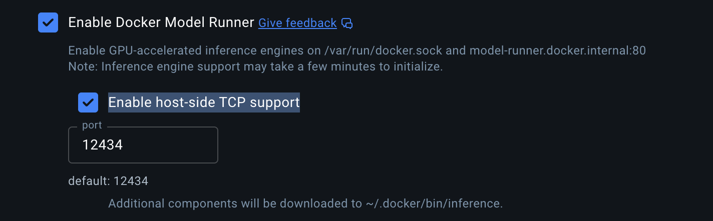
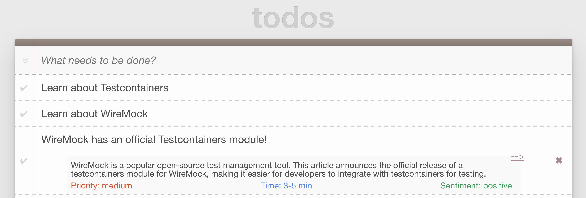
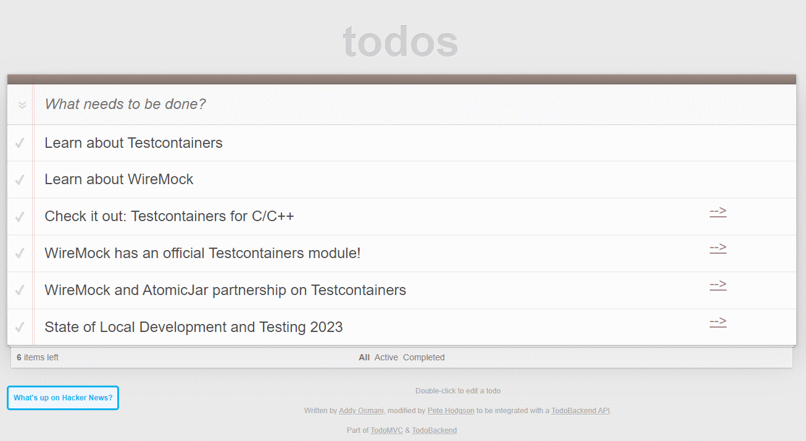

# Spring I/O - Testcontainers and WireMock Workshop

Shows a TODO list that also allows loading top stories for reading from Hackernews...
and also loading them from a [WireMock](https://wiremock.org/) mock API
running in [Testcontainers](https://www.testcontainers.org/).

## Prerequisites

* Docker Desktop or another Testcontainers-enabled engine

## Workshop Plan

### Getting Started - Local database

1. Clone this repository or download and unzip it.
2. Run the database with `docker compose up`
3. Run application locally with `./gradlew bootRun`
4. Open the application in the browser: [link](http://localhost:8080/?http://localhost:8080/todos)
5. Click the _What's up on Hackernews?_ to see what new get loaded for your reading list!

### Part I. Containers for Development

Let's write a few tests with Testcontainers

1. We will use Postgres in a Container
2. We can use Developer Services. They are [available](https://docs.spring.io/spring-boot/reference/features/dev-services.html) in Spring Boot, too!
    * Uncomment `withDevServices` in `gradle.settings.kts`
3. We can use Testcontainers for tests - `TodoControllerTest`
4. We can use Testcontainers as a Dev Service!
5. Run application locally with `./gradlew bootTestRun`

Task: We have a database with the migration script.
Let's test that we use the right versions and can actually migrate.

### Part II. Now with WireMock

For this part, we will download additional reading tasks from Hacker News.
They have a [public API](https://github.com/HackerNews/API).

* There is a Spring Boot integration, 
   now a part of the WireMock organization: [WireMock Spring Boot](https://github.com/wiremock/wiremock-spring-boot)
* There is a Testcontainers module for WireMock that embeds everything:
  [wiremock/wiremock-testcontainers-java](https://github.com/wiremock/wiremock-testcontainers-java).
  We use it in the workshop.
* You can use a Dev Service too.
 
Steps:

1. Try the application against the production server. It might work... or not
2. Enable the WireMock service in Docker Compose by uncommenting the bits in 
   `docker-compose.yml`, `gradle.properties`, and `application.yml`
2. Check out the `ContainersConfig` class to see how elegant the Spring Boot and Testcontainers integration is now.
Let's write a few tests for the Hackernews API provider with them.
2. Check out the WireMock JSON and how non-elegant it is
3. See `ApplicationTests` for wiring examples

Tasks:

4. Write a new test that roundrips the data, for a new Hackernews entry about Spring I/O
5. Add a new test with a server that returns error - no Data found, and validates the client behavior for it
6. BONUS: Add a test that configures WireMock on the flight... in code

### Part 3. Let's add some AI?

* Docker Model Runner: https://docs.docker.com/model-runner/
* Spring AI: https://spring.io/projects/spring-ai
* Ensure to enable host-side TCP support



The application will use AI to process Hacker News articles and provide a quick understanding of their content.
The `AiService` class is responsible for this functionality. It interacts with an AI model to generate:
- A concise summary of the article.
- An estimated priority (low/medium/high) for a general tech-savvy user.
- An estimated time to read and understand the article and its comments.
- A predicted sentiment (positive/negative/neutral) of the article and its discussion.

To enable the AI features, you'll need to use a local AI model. We'll be using the `ai/gemma3-qat:1B-Q4_K_M` model.

**Setup Instructions:**

1.  **Enable Docker Model Runner:**
    In Docker Desktop settings, navigate to the "Beta features" tab and ensure that "Enable Docker Model Runner" is checked.

2.  **Pull the Docker Model:**
    Open your terminal and pull the model from Docker Hub:
    ```bash
    docker model pull ai/gemma3-qat:1B-Q4_K_M
    ```
    These models are OCI artifacts available in the `ai` namespace on [hub.docker.com/u/ai](hub.docker.com/u/ai).
3. **Run models with Docker Model Runner** 
    As a quick test you can run models direclty in your terminal: 
    ```bash
    docker model run ai/gemma3-qat:1B-Q4_K_M
    ```
    And chat with the model to verify it is pulled and configured correctly. 

Once these steps are completed, the application will be able to leverage the local AI model for processing Hacker News items.

Tasks: 

**Configure AI in the application** 
Configure Spring AI to use OpenAI compatible API of Docker Model Runner. 
In the application.properties file, we should have a block configuring Spring AI: 

```bash
spring:
  ai:
    openai:
      chat:
        enabled: true
        options:
          model: ai/gemma3-qat:1B-Q4_K_M #ai/qwen3:30B-A3B-Q4_K_M
      base-url: http://localhost:12434/engines/
      api-key: "spring-boot, please don't yell at me"
```

Note that models are run locally so it doesn't require an API KEY and doens't cost anything. 

Explore the AI configuration, like a real prompt engineer. In the AiService class, we have the ConversationalConfiguration which specifies our AI logic in the system prompt for the chat client. 

AiService itself is a bean we use in the application to trigger calls to AI. 

Docker Model Runner can be configured to be accessible from the localhost (in the Docker Desktop settings), but we can also use `DockerModelRunnerContainer` class from Testcontainers to enable seamless integration from your application. 

`DockerModelRunnerContainer` will proxy to the correct urls where Docker Model Runner is available and will be OS agnostic, so the same code and tests will work, for example, on Linux in your CI pipelines. Note that Docker Model Runner is currently available on Macos and Windows with NVidia GPUs, but will be integrated into Docker CE soon (work in progress).

Add a DockerModelRunnerContainer Bean to the ContainersConfig: 
```java
 @Bean
DockerModelRunnerContainer dockerModelRunnerContainer() {
    var container = new DockerModelRunnerContainer("alpine/socat:1.8.0.1");
    return container;
}
```

Use DockerModelRunnerContainer bean to provide the value `spring.ai.openai.base-url` at runtime.
```java
@Bean
DynamicPropertyRegistrar apiPropertiesRegistrar(WireMockContainer wireMockContainer, DockerModelRunnerContainer dockerModelRunnerContainer) {
    return registry -> {
        registry.add("hackernews.base-url", wireMockContainer::getBaseUrl);
        registry.add("spring.ai.openai.base-url", dockerModelRunnerContainer::getOpenAIEndpoint);
    };
}
```

Run TestApplication, open the application UI in a browser and check that pulling stories from HackerNews also triggers our AI functionality now. 



**Testing AI applications** 

From the architecture point of view, AI components are largely just APIs. Often the application will query a remote service running the LLM with a prompt, receive a response and convert it into the application data model. 
AI responses are non-deterministic and thus testing these interactions becomes crucial for production applications. 

Integration tests are perfect for testing "black-box" AI components, and in a typical application we'll have the following kinds of tests:
* Sanity tests: using a local model you can model your production LLM and verify that your prompts are sufficient for "dumber" LLM, so could work for production LLM. 
* Data-driven tests: it's hard to make a model output particular responses, so we mock the AI provider with Wiremock or Microcks services and inject data we need application to be able to handle.
* Negative use-cases tests: 
  * AI responses are too slow
  * AI responses are nonsense text
  * AI responses do not respect the intended schema 


Negative use cases are also hard to verify on either production or local models. And it makes a lot of sense to mock the responses on the service level in your integration tests. 

Let's start with the sanity test that shows the application wires together and there exist setups where intended functionality works:

Add the following `todosCanBeLoaded` test to the  `ApplicationTests` class. It wires together the whole application, and sends a request to 'todos/hn'  
```java
@Test
void todosCanBeLoaded() {
    given(requestSpecification)
        .when().post("/todos/hn")
        .then().statusCode(200);


    await().atMost(10, SECONDS).untilAsserted(() -> {
        JsonPath jsonPath = given(requestSpecification)
            .when().get("/todos")
            .then().statusCode(200)
            .extract().body().jsonPath();

        List<Todo> todos = jsonPath.getList("", Todo.class);
        Assertions.assertThat(todos).hasSize(6);
    });
}
```

Now lets replace using a real LLM (local but real with all its non-determinism and quirks) with a mocked solution:

Look at the MockAIContainersConfig class, it configures WireMockContainer with additional mocks to respond to the queries we send to the LLM: 
```java
@Bean
WireMockContainer wireMockContainer() {
    var container = new WireMockContainer("wiremock/wiremock:3.13.0")
        .withMappingFromResource("hackernews", "mappings/hackernews_v0-stubs.json")
         .withMappingFromResource("AI Model", "ai/mappings/aimodel.json");    ;

    return container;
}

@Bean
DynamicPropertyRegistrar apiPropertiesRegistrar(WireMockContainer wireMockContainer) {
    return registry -> {
        registry.add("hackernews.base-url", wireMockContainer::getBaseUrl);
        registry.add("spring.ai.openai.base-url", wireMockContainer::getBaseUrl);
    };
}
```

Look at the `AIServiceTests` class to see the tests that use that configuration. 

** Tasks for the reader ** 
* Implement slow down with wiremock injecting latency (https://wiremock.org/docs/simulating-faults/)
* Change the mocked data to not conform to the schema (for example, removing some of the fields in the response or changing it altogether)
* Change the mocked data to have non-sensical summary. How would you change the application logic to check of that? Maybe using another LLM as a guardrail? 

### Screenshot

Demo app after loading Hacker News best stories from the WireMock container:



## Recording AI Interactions

* Guide: https://wiremock.org/docs/record-playback/
* `docker run -it --rm -p 8081:8080 wiremock/wiremock:3.13.0 --disable-http2-plain   
`
* Go to http://localhost:8081/__admin/recorder/
* Record http://model-runner.docker.internal:80/


## References

- [Video from the Devoxx BE talk](https://www.youtube.com/watch?v=eFILbyaMI2A) - see the _Mega Demo_ part for this demo (from ~30:00)
- [Slides from the Devoxx BE 2023 talk](https://docs.google.com/presentation/d/e/2PACX-1vQSgTTCg-LkmrL-5UuAE63zxuWP0kADBetXXBqMVO-oEQWfP6zGu16eFSdKxvEbchDnaCwKZ2a7134F/pub?start=false&loop=false&delayms=3000)
- [WireMock Module for Testcontainers](https://testcontainers.com/modules/wiremock/)
- [HackerNews Mock API](https://library.wiremock.org/catalog/api/y/ycombinator.com/hackernews_v0/) on the
  [WireMock API Templates Library](https://library.wiremock.org/)
